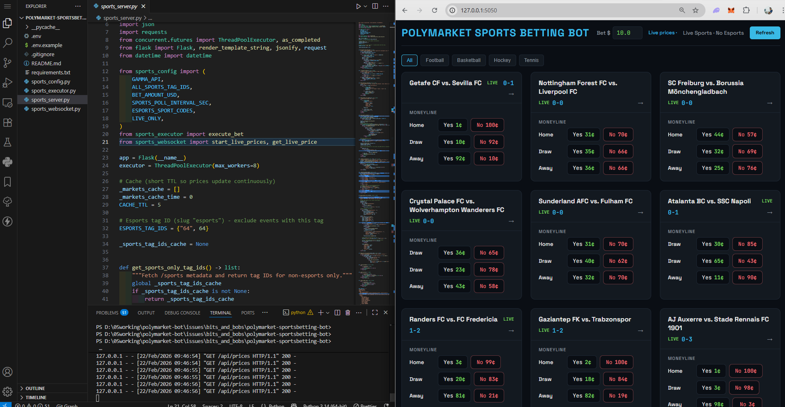
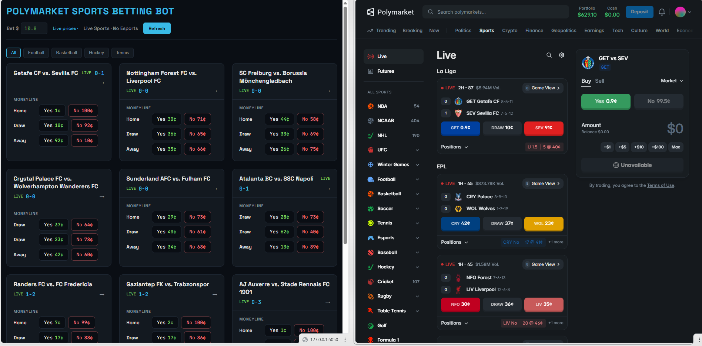
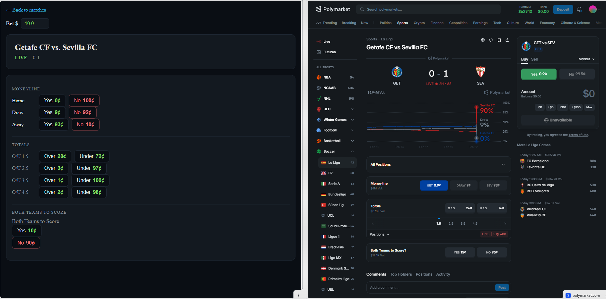
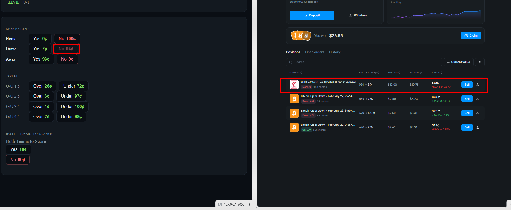

# Polymarket Sports Betting Bot – Fast Click-to-Bet for Live Sports

**Contact:** [Telegram @movez_x](https://t.me/movez_x)

[English](README.md) | [中文](README.zh.md)

---

## What is this bot?

This bot helps sports betting traders on Polymarket by giving you a fast, focused interface for live sports markets.   Instead of navigating the main site, you get a clean grid of live games (football, basketball, hockey, tennis) with real-time prices—no esports clutter.   
You click, the bot places your order in **~20ms** using market orders (FAK), so you can react quickly when odds move. It’s manual click-to-bet: you make every decision, the bot handles execution. Made with Rust.

---

## Screenshots






---

## 3 Advantages for Traders

1. **Speed = edge** – Place orders within ~20ms. In live sports betting, odds move fast. The quicker you execute, the better price you lock in—and the more profit you keep instead of getting slipped.
2. **Live prices, no lag** – Real-time WebSocket updates mean you see the true market before you bet. No stale prices, no full-page refresh delays. Trade on what’s actually there.
3. **Your edge, your control** – No black-box automation. You spot the value, you click. The bot executes. Keep your edge and your discretion—ideal for traders who know sports.

---

## Add a feature, get help, or go premium

Contact via **Telegram: [@movez_x](https://t.me/movez_x)**

---

## How to run

1. Copy `.env.example` to `.env` and add your wallet:

   ```bash
   cp .env.example .env
   ```

2. Install dependencies:

   ```bash
   pip install -r requirements.txt
   ```

3. Run the bot:

   ```bash
   python sports_server.py
   ```

4. Open **http://localhost:5050** in your browser.

---

## Contact

**Telegram:** [@movez_x](https://t.me/movez_x)
